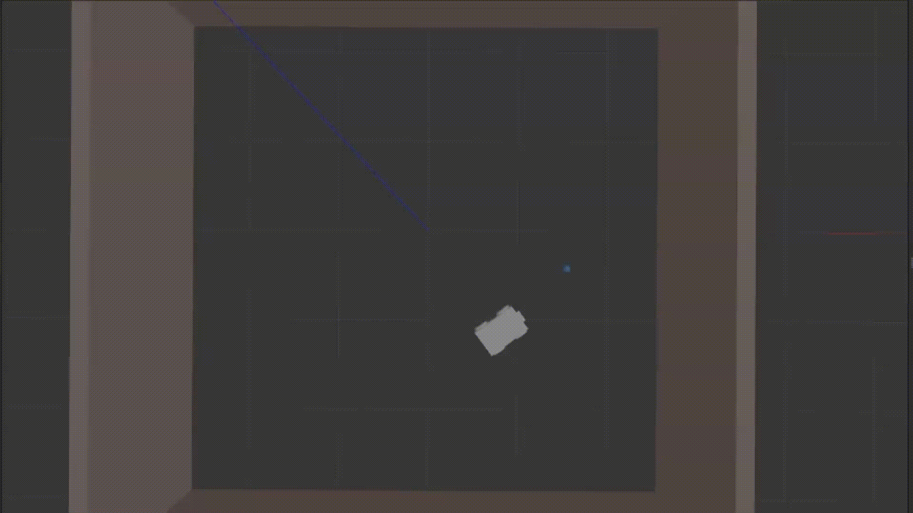

# ROS Object Tracking Mobile Robot




A **robust, real-time computer vision–based navigation system** for a four-wheeled mobile robot. This project demonstrates the tight integration of **perception, decision-making, and control** using the **Robot Operating System (ROS)**, validated both in simulation and on a real hardware prototype.

---

## Team Members

* **Bassam Sayed**
* **Mohammed Ihab**
* **Youssef Mohamed**

---

## Project Overview

This project implements an autonomous **object tracking and following system** for a mobile robot. Using a camera-based perception pipeline, the robot detects a target object in real time and continuously adjusts its **linear and angular velocities** to maintain a desired distance and alignment.

The system is designed with a **modular ROS architecture**, allowing seamless switching between simulation and physical deployment. Emphasis is placed on system stability, robustness to noise, and real-time performance.

---

## Key Capabilities

* **ROS-Based Architecture:** Fully implemented using ROS nodes, topics, and launch files.
* **Simulation & Real Deployment:** Tested in Gazebo simulation and validated on a physical robot.
* **Multiple Vision Pipelines:** Two complementary computer vision algorithms for reliable object detection.
* **Closed-Loop Control:** PID-based velocity control for smooth and stable tracking behavior.
* **Scalable Design:** Easily extendable to other sensors, robots, or detection methods.

---

## Computer Vision & Perception

The perception node processes camera images in real time to isolate and track the target object. Two detection strategies are implemented to improve robustness under different conditions:

### Contour-Based Detection

* Image segmentation using **HSV color space**.
* Noise reduction through morphological filtering.
* Contour extraction and centroid estimation.
* Suitable for irregularly shaped or color-specific objects.

### Hough Circle Transform

* Designed specifically for **spherical objects** (e.g., balls).
* Uses edge detection followed by a parameter-space voting mechanism.
* More robust to partial occlusions and lighting variations compared to simple thresholding.

---

## Control Strategy

* Target position error is computed from image coordinates.
* Distance estimation is derived from object size in the image.
* A **PID controller** generates smooth linear and angular velocity commands.
* Control commands are published to the robot velocity topic and executed by the motor controller.

---

## System Components

### Hardware

* **Intel RealSense Depth Camera D435i**
* **Arduino Uno** (motor control interface)
* **Laptop** (running ROS and vision processing)
* **Four-Wheeled Mobile Robot Chassis**

### Software

* **Operating System:** Ubuntu 20.04
* **ROS Distribution:** ROS Noetic
* **Programming Languages:** Python (rospy)
* **Libraries:** OpenCV, NumPy
* **Simulation & Visualization:** Gazebo, RViz

---

## Installation & Build

1️⃣ **Clone the repository**

```bash
cd ~/catkin_ws
git clone https://github.com/Mohammed-Ihab/ros-object-tracking-mobile-robot.git
```

2️⃣ **Build the workspace**

```bash
cd ~/catkin_ws
catkin_make
source devel/setup.bash
```

---

## Usage

### Run in Simulation

```bash
roslaunch bringup sim_bringup.launch
```

### Run on Real Robot

```bash
roslaunch bringup rs_bringup.launch
```

Ensure the Arduino, camera, and motor drivers are properly connected before launching the hardware configuration.

---

## Project Folder Structure

```text
ros-object-tracking-robot/src/
├── bringup/
│   ├── launch/
│   │   ├── sim_bringup.launch
│   │   └── rs_bringup.launch
│   ├── CMakeLists.txt
│   └── package.xml
│
├── detect_ball/
│   ├── scripts/
│   │   ├── ball_move.py
│   │   ├── rs_contour_detection.py 
│   │   ├── rs_hough_detection.py
│   │   ├── sim_contour_detection.py
│   │   └── sim_hough_detection.py
│   ├── CMakeLists.txt
│   └── package.xml
│
├── robot_control/
│   ├── launch/
│   │   └── arduino.launch
│   ├── scripts/
│   │   ├── rs_vel_controller.py
│   │   └── sim_vel_controller.py
│   ├── CMakeLists.txt
│   └── package.xml
│
├── robot_description/
│   ├── urdf/
│   │   ├── four_wheel.xacro
│   │   └── four_wheel.gazebo
│   ├── launch/
│   │   └── empty_world.launch
│   ├── worlds/
│   │   └── four_wheel_env.world
│   ├── CMakeLists.txt
│   └── package.xml
│
└── CMakeLists.txt
```

---

## Future Improvements

* Weight Reduction
* Environmental Sensing and Obstacle Avoidance
* Using Encoders to take feedback about Wheel speed for closed loop control

---
